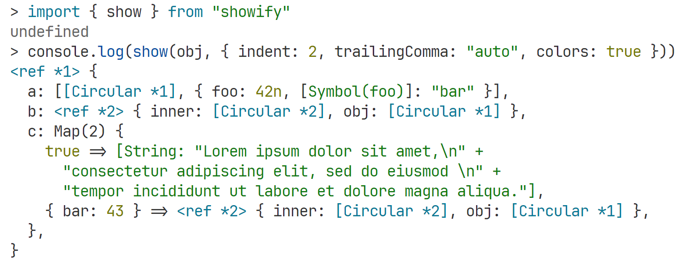

<h1 align="center">showify</h1>

<p align="center">
  Arguably the <strong><i>most comprehensive</i></strong> cross-platform library for <strong>stringifying</strong> <i>any</i> JavaScript value into a human-readable format, handling nearly every scenario you might encounter.
</p>

<p align="center">
  <a href="https://www.npmjs.com/package/showify">
    
  </a>
  <a href="https://www.npmjs.com/package/showify">
    
  </a>
  <a href="https://bundlephobia.com/package/showify">
    
  </a>
  <a href="https://coveralls.io/github/Snowflyt/showify?branch=main">
    
  </a>
  <a href="https://github.com/Snowflyt/showify">
    
  </a>
</p>



## Features

- **Stringify** _any_ JavaScript value in a format similar to `util.inspect` in Node.js. Special cases like Map, Set, array empty slots, wrapper objects for primitives, ArrayBuffer, DataView, WeakMap, WeakSet, and more are handled properly.
- Support for maximum recursion **depth** in nested objects.
- **Circular references** displayed with a **reference pointer** (e.g., `<ref *1> { foo: { bar: [Circular *1] } }`) instead of just `[Circular]`.
- Auto **indentation** and **line breaking** for long outputs, just like `console.log`/`util.inspect` in Node.js and Deno.
- **ANSI color** support.
- Highly customizable options for indentation, quote style, hidden properties, colors, and more.
- **Custom serializers** for your own types, with a user-friendly API that works on a tree-like structure instead of raw strings, handling maximum recursion depth, indentation, and circular references automatically — without any extra effort.

## Quickstart

Simply import the `show` function and use it to stringify _any_ JavaScript value:

```javascript
import { show } from "showify";

const value = {
  foo: "bar",
  "Hello\nworld": [-0, 2n, NaN],
  [Symbol("qux")]: { quux: "corge" },
  map: new Map([
    ["foo", "bar"],
    [{ bar: 42 }, "qux"],
  ]),
};
value.circular = value;

console.log(show(value, { indent: 2, trailingComma: "auto", colors: true }));
// <ref *1> {
//   foo: "bar",
//   "Hello\nworld": [-0, 2n, NaN],
//   map: Map(2) { "foo" => "bar", { bar: 42 } => "qux" },
//   circular: [Circular *1],
//   Symbol(qux): { quux: "corge" },
// }
```

The `show()` function accepts an optional second argument for options. Some common options are listed here:

- **`depth`**: Maximum recursion depth, defaults to `Infinity`.
- **`indent`**: Number of spaces to indent, defaults to `0`. To enable indentation and auto line breaking, set `indent` to a positive integer, e.g., `2`.
- **`breakLength`**: Maximum line length before breaking, defaults to `80`. This option is ignored if `indent` is `0`.
- **`sorted`**: Whether to sort the keys of objects (including `Map`s and `Set`s) in the resulting string, defaults to `false`.
- **`quoteStyle`**: Preferred quote style for strings, should be `"single"`, `"double"`, `"backtick"`, or an array of them to try in order, defaults to `["double", "single", "backtick"]`.
- **`trailComma`**: Whether to add a trailing comma to the last element of an array or object, should be `"none"`, `"always"` or `"auto"` (add trailing comma only when the last item is on a separate line), defaults to `"none"`.
- **`colors`**: Enable ANSI colors, defaults to `false`.

**showify** supports many other options. For a complete list of options, see [the available options section](#available-options) below.

Note that **showify** uses slightly different default options compared to `util.inspect` in Node.js. If you want to achieve the exactly same default output as `util.inspect` in Node.js, see [the related FAQ](#how-can-i-achieve-the-exactly-default-output-as-utilinspect-in-nodejs).

## Installation

To install **showify** via npm (or any other package manager you prefer):

```shell
npm install showify
```

If you prefer a lightweight version with a smaller bundle size, you may also consider [@showify/lite](https://github.com/Snowflyt/showify/tree/main/packages/lite), which removes ANSI color support and several other features that are not needed for most use cases.

## Comparison

Here’s a comparison of the features of **showify**, `util.inspect` in Node.js, and other libraries:

- ✅ 1st-class, built-in, and ready to use with no additional configuration or code.
- 🟡 Supported, but has limitations or is not as complete as **showify**.
- 🔶 Supported and documented, but not out-of-the-box or requires extra user-code to implement.
- ❌ Not officially supported or documented.

| Feature                                    | showify                                                                                                                                                    | `util.inspect`    | pretty-format                                                                                                                                                          | object-inspect                                                                                                                                                           | stringify-object                                                                                                                                                             |
| ------------------------------------------ | ---------------------------------------------------------------------------------------------------------------------------------------------------------- | ----------------- | ---------------------------------------------------------------------------------------------------------------------------------------------------------------------- | ------------------------------------------------------------------------------------------------------------------------------------------------------------------------ | ---------------------------------------------------------------------------------------------------------------------------------------------------------------------------- |
| Bundle size                                | <a href="https://bundlephobia.com/package/showify"></a> | ❓                | <a href="https://bundlephobia.com/package/pretty-format"></a> | <a href="https://bundlephobia.com/package/object-inspect"></a> | <a href="https://bundlephobia.com/package/stringify-object"></a> |
| Indentation                                | ✅                                                                                                                                                         | 🟡 uncustomizable | ✅                                                                                                                                                                     | ✅                                                                                                                                                                       | ✅                                                                                                                                                                           |
| Auto line breaking                         | ✅                                                                                                                                                         | ✅                | ❌                                                                                                                                                                     | ❌                                                                                                                                                                       | ❌                                                                                                                                                                           |
| Array elements grouping [1]                | ✅                                                                                                                                                         | ✅                | ❌                                                                                                                                                                     | ❌                                                                                                                                                                       | ❌                                                                                                                                                                           |
| Circular references                        | ✅                                                                                                                                                         | ✅                | ✅                                                                                                                                                                     | ✅                                                                                                                                                                       | ✅                                                                                                                                                                           |
| Circular reference pointers                | ✅                                                                                                                                                         | ✅                | ❌                                                                                                                                                                     | ❌                                                                                                                                                                       | ❌                                                                                                                                                                           |
| Maximum recursion depth                    | ✅                                                                                                                                                         | ✅                | ✅                                                                                                                                                                     | ✅                                                                                                                                                                       | ❌                                                                                                                                                                           |
| ANSI colors                                | ✅                                                                                                                                                         | ✅                | 🔶                                                                                                                                                                     | ❌                                                                                                                                                                       | ❌                                                                                                                                                                           |
| Sorted keys                                | ✅                                                                                                                                                         | ✅                | ✅                                                                                                                                                                     | ❌                                                                                                                                                                       | ❌                                                                                                                                                                           |
| Auto select proper quote style for strings | ✅                                                                                                                                                         | ✅                | ❌                                                                                                                                                                     | ❌                                                                                                                                                                       | ❌                                                                                                                                                                           |
| Custom quote style                         | ✅                                                                                                                                                         | ❌                | ❌                                                                                                                                                                     | 🟡 [2]                                                                                                                                                                   | 🟡 [2]                                                                                                                                                                       |
| Auto line break for long multiline strings | ✅                                                                                                                                                         | ✅                | ❌                                                                                                                                                                     | ❌                                                                                                                                                                       | ❌                                                                                                                                                                           |
| Trailing comma                             | ✅                                                                                                                                                         | ❌                | 🟡 forced                                                                                                                                                              | ❌                                                                                                                                                                       | ❌                                                                                                                                                                           |
| Hidden (non-enumerable) properties         | ✅ [3]                                                                                                                                                     | ✅                | ❌                                                                                                                                                                     | ❌                                                                                                                                                                       | ❌                                                                                                                                                                           |
| Proper getters/setters inspection [3]      | ✅                                                                                                                                                         | ✅                | ❌                                                                                                                                                                     | ❌                                                                                                                                                                       | ❌                                                                                                                                                                           |
| `Symbol.toStringTag` support               | ✅                                                                                                                                                         | ✅                | ❌                                                                                                                                                                     | 🟡                                                                                                                                                                       | ❌                                                                                                                                                                           |
| Custom serializers                         | ✅                                                                                                                                                         | ✅                | ✅                                                                                                                                                                     | ✅                                                                                                                                                                       | ✅                                                                                                                                                                           |
| Promise inspection                         | 🟡 [4]                                                                                                                                                     | ✅                | ❌                                                                                                                                                                     | ❌                                                                                                                                                                       | ❌                                                                                                                                                                           |
| WeakMap/WeakSet inspection                 | 🟡 [5]                                                                                                                                                     | ✅                | ❌                                                                                                                                                                     | ❌                                                                                                                                                                       | ❌                                                                                                                                                                           |
| Proxy inspection                           | ❌                                                                                                                                                         | ✅                | ❌                                                                                                                                                                     | ❌                                                                                                                                                                       | ❌                                                                                                                                                                           |

<p>
  <div><small>[1]: Groups multiple short elements of an array onto the same line for better readability when placing the entire array on a single line would exceed the `breakLength`. This is particularly useful for arrays with many short elements, such as <code>[1, 2, 3, 4, 5, 6, 7, 8, 9, 10]</code>, which can be displayed as <code>[\n  1,  2, 3, 4,\n  5,  6, 7, 8,\n  9, 10\n]</code> instead of placing each element on a separate line.</small></div>
  <div><small>[2]: object-inspect and stringify-object only supports single or double quotes, while <strong>showify</strong> supports automatic quote style.</small></div>
  <div><small>[3]: In addition to <code>showHidden: boolean</code> from Node.js, <strong>showify</strong> also provides an <code>"exclude-meta"</code> option, which behaves like <code>true</code> but removes common meta properties like the <code>length</code> property of arrays from the output.</small></div>
  <div><small>[4]: Whether to treat getters/setters specially. Getters may throw errors, so it’s important to account for such cases.</small></div>
  <div><small>[5]: <code>Promise</code> objects are displayed as <code>Promise { &lt;state unknown&gt; }</code>, since it’s impossible to determine the state of a <code>Promise</code> without awaiting it.</small></div>
  <div><small>[6]: <code>WeakMap</code> and <code>WeakSet</code> objects are displayed as <code>${className} { &lt;items unknown&gt; }</code> even when <code>showHidden</code> is <code>"always"</code>, since it’s impossible to retrieve the values of a <code>WeakMap</code> or <code>WeakSet</code> without knowing the keys.</small></div>
</p>

Aside from the features listed above, **showify** also supports many more special cases than other libraries, such as wrapper objects for primitives (e.g., `new String("foo")`), async/generator functions, ES6 classes, and more.

## Documentation

### Limitations

- **Module:** Module detection may be misled by `Symbol.toStringTag`. If an object has a non-writable, non-enumerable, and non-configurable `Symbol.toStringTag` property set to `"Module"`, it will be considered a module.
- **Promise:** `Promise` objects are displayed as `Promise { <state unknown> }`, since it’s impossible to determine the state of a `Promise` without awaiting it.
- **Proxy:** `Proxy` objects are treated as regular objects, since it’ impossible to identify whether an object is a `Proxy` in vanilla JavaScript.
- **WeakMap/WeakSet:** `WeakMap` and `WeakSet` objects are displayed as `${className} { <items unknown> }` even when `showHidden` is `"always"`, since it’s impossible to retrieve the values of a `WeakMap` or `WeakSet` without knowing the keys.

### Known differences from `util.inspect` in Node.js

- **Default options:** **showify** uses slightly different default options compared to `util.inspect` in Node.js. For example, **showify** uses infinite depth, prefers double quotes, and does not break lines by default, while `util.inspect` uses a depth of `2`, prefers single quotes, and breaks lines by default. See [the related FAQ](#how-can-i-achieve-the-exactly-default-output-as-utilinspect-in-nodejs) if you want to achieve the exact same default output as `util.inspect` in Node.js.
- **Custom serialization:** **showify** supports custom serialization via both the special `Symbol(nodejs.util.inspect.custom)` property (compatible with Node.js) and through the `serializers` option in the `show` function or its own `Symbol(showify.inspect.custom)` property, while `util.inspect` only supports the former.
- **Break length:** **showify** tries to break lines exactly at `breakLength` characters, while `util.inspect` may break lines at slightly different positions due to a different algorithm for calculating the break position.
- **Circular reference pointer:** **showify** always displays a reference pointer when the same object is referenced, while `util.inspect` does not always do so if the same object is referenced multiple times.
- **`Symbol.toStringTag`:** `util.inspect` shows `Symbol(Symbol.toStringTag): "..."` for some objects (like generators and generator functions) when `showHidden` is `true`, even if `Symbol.toStringTag` is not an own property of the object. **showify** does not show this in such cases.

### A complete list of rules for stringifying JavaScript values

**Common rules:**

- **Maximum recursion depth:** Values are stringified up to the specified `depth` (defaults to `Infinity`). When stringifying a value, if the current depth exceeds the specified `depth`, **showify** checks if further recursion is necessary. If recursion is not needed, it simply stringifies the value as is. If further recursion is needed, **showify** displays `[${className}]` and stops further recursion. A special case occurs when the value’s `[[Prototype]]` is `null`, in which case the value is displayed as `[Object: null prototype]`.
- **Break length:** Lines are wrapped at the `breakLength` (defaults to `80`) characters when possible. When stringifying a value, **showify** first attempts to use the inline format. If the inline format doesn’t exceed the `breakLength`, it switches to the multiline format. This process is repeated recursively for each child value. Specially for arrays, when the inline format would exceed the `breakLength`, **showify** tries to group multiple short elements onto the same line to reduce the number of lines, still respecting the limit. For example, an array like `[1, 2, 3, 4, 5, 6, 7, 8, 9, 10]` may be displayed as `[\n  1,  2, 3, 4,\n  5,  6, 7, 8,\n  9, 10\n]` instead of placing each element on a separate line. This grouping is conservative and is not applied if the array is too small to benefit from grouping or if it contains elements that are too long, which would cause uneven spacing.
- **Circular references:** Objects with circular references are displayed with a reference pointer. For example, `<ref *1> { foo: [ [Circular *1] ], bar: <ref *2> { inner: [Circular *2], obj: [Circular *1] } }`.
- **`.[Symbol.for("nodejs.util.inspect.custom")]()`**: If `callNodeInspect` is `true`, **showify** calls `[Symbol.for("nodejs.util.inspect.custom")]()` on the value before stringifying it (if available). This option takes precedence over `callToJSON`.
- **`.[Symbol.for("showify.inspect.custom")]()`**: If `callCustomInspect` is `true`, **showify** calls `[Symbol.for("nodejs.inspect.custom")]()` on the value before stringifying it (if available). This option takes precedence over `callToJSON` and `callNodeInspect`.
- **`.toJSON()`**: If `callToJSON` is `true`, **showify** calls `toJSON()` on the value before stringifying it (if available).
- **Extra keys:** Extra keys of any special object (e.g., wrapper objects for primitives, errors, promises, functions, arrays) are displayed. For example, `[Function: foo] { bar: "baz" }` or `[1, 2, 3, foo: "bar"]`.
- **Class name:** An object’s `${className}` is defined as the first non‑empty `.constructor.name` found while walking up the prototype chain, or `"Object"` if none is found. For cross‑realm and Proxy objects, we only accept a name when the own `constructor` is a function and `value instanceof constructor` is `true`.
- **`Symbol.toStringTag`:** If an object has a `Symbol.toStringTag` property that is not already shown and its `${className}` does not end with the value of `Symbol.toStringTag`, it is displayed as the following:
  - For `Date`s and `RegExp`s, it is displayed with brackets around after the class name, e.g., `Date [MyTag] 2025-02-13T11:42:41.196Z` or `MyRegExp [MyTag] /(?:)/ { foo: 'bar' }`.
  - For `Error`s, it is displayed with brackets around after the error name, e.g., `Error [MyTag]: error message\n    at ...` or `[TypeError [MyTag]: error message]`.
  - For ES6 classes, it is displayed with brackets around after the class name, e.g., `[class MyClass [MyTag]]` or `[class MyClass [MyTag] extends MySuperClass]`.
  - For other objects, the tag is displayed with brackets around after its original prefix (if it does not have a prefix, the prefix is defined as `${className}`), e.g., `Object [MyTag] { foo: "bar" }`or`[String: "foo"] [MyTag]`.

**Primitive values:**

- **Undefined:** `undefined` is displayed as `undefined`. Gray if `colors` is `true`.
- **Null:** `null` is displayed as `null`. Bold if `colors` is `true`.
- **Boolean:** `true` and `false` are displayed as `true` and `false`, respectively. Yellow if `colors` is `true`.
- **Number:** Numbers are displayed as their literal values, e.g., `42`. Yellow if `colors` is `true`.
- **BigInt:** BigInts are displayed as their literal values with **n** suffix, e.g., `42n`. Yellow if `colors` is `true`.
- **String:** Strings are displayed as their literal values with quotes based on the `quoteStyle` option, e.g., `"foo"`. Green if `colors` is `true`. When backticks are a candidate, showify avoids using backticks if the string contains the sequence `${` to prevent it from looking like a template literal. In that case, the next available quote style in your preference order is chosen.
- **Multi-line strings:** Multi-line strings are broken into `"${s1}\n" + "${s2}\n" + ...` if its indentation plus the length of the string exceeds `breakLength`. Each part is colorized separately if `colors` is `true`, and `+`s are not colorized.
- **Long strings:** If `maxStringLength` is set and the string is longer than `maxStringLength`, it is displayed as `"${s}"... ${n} more character${n === 1 ? "" : "s"}`, e.g., `"foo bar"... 3 more characters`. This also applies to multi-line strings, e.g., `"foo\n" + "bar"... 1 more character"`.
- **Symbol:** Symbols are displayed as their literal values, e.g., `Symbol(foo)`. Green if `colors` is `true`.
- **Wrapper objects for primitives:** Wrapped primitive values are displayed as `[${Type}: ${value}]`, e.g., `[String: "foo"]`. Their colors are the same as their primitive values if `colors` is `true`. If a wrapped primitive’s `${className}` is not equal to its `${Type}`, it is displayed as `[${Type} (${className}): ${value}]`, e.g., `[String (MyString): "foo"]`.

**Special objects:**

- **Date:** `Date` objects are displayed as `date.toISOString()`. If `${className}` is not `"Date"`, it is displayed as `${className} ${date.toISOString()}`.
- **RegExp:** `RegExp` objects are displayed as `re.toString()`. If `${className}` is not `"RegExp"`, it is displayed as `${className} ${re.toString()}`. When `colors` is `true`, the RegExp is syntax highlighted with a highlighter adapted from [Node.js’s implementation of `util.inspect`](https://github.com/nodejs/node/blob/dec0213c834607e7721ee250d8c46ef9cd112efe/lib/internal/util/inspect.js#L526-L768) that follows the ECMAScript grammar (groups, assertions, escapes, character classes, quantifiers, etc.). You can customize this via `styles.regexp`.
- **Error:** `Error` objects are displayed as `error.stack` if available and valid, or `[${error.stack}]` if `error.stack` is available but invalid, or `[${className}: ${error.message}]` if message is available, or `[${className}]` otherwise.
- **Promise:** `Promise` objects are displayed as `Promise { <state unknown> }`.
- **ArrayBuffer:** `[Uint8Contents]` and `byteLength` are displayed for `ArrayBuffer` objects. For example, `ArrayBuffer { [Uint8Contents]: <2a 00 00 00 00 00 00 00>, [byteLength]: 8 }`. `maxArrayLength` is respected when displaying `[Uint8Contents]`. If the `ArrayBuffer` is [detached](https://developer.mozilla.org/docs/Web/JavaScript/Reference/Global_Objects/ArrayBuffer#transferring_arraybuffers), it is displayed as `ArrayBuffer { (detached), [byteLength]: 0 }`.
- **DataView:** `byteLength`, `byteOffset` and `buffer` are displayed for `DataView` objects. For example, `DataView { [byteLength]: 8, [byteOffset]: 0, [buffer]: ArrayBuffer { [Uint8Contents]: <2a 00 00 00 00 00 00 00>, [byteLength]: 8 } }`.

**Classes and functions:**

- **ES6 Class:** If a callable (i.e., `typeof value === "function"`) object is an ES6 class, it is displayed as `[class ${className}]` or `[class (anonymous)]` if the class name is not available, or `[class ${className} extends ${superClassName}]` if the class has a superclass and the superclass name is available.
- **Function:** Functions are shown as `[${Type}: ${name}]` or `[${Type} (anonymous)]` (`Type` is `Function`, `AsyncFunction`, `GeneratorFunction`, or `AsyncGeneratorFunction`); if the resolved `${className}` differs from `Type`, append it—except when it is `"Object"`.

**Collections:**

- **Array:** `Array` objects are displayed as `[e1, e2, ...]`. Empty slots are displayed as `<${n} empty item${n === 1 ? "" : "s"}>`. For subclasses of `Array` or typed arrays, the `${className}` is displayed with its size, e.g., `MyArray(4) [1, <2 empty items>, 2, { foo: "bar" }]` or `Uint8Array(3) [1, 2, 3]`.
- **Typed arrays:** Typed arrays (e.g., `Uint8Array`, `Int16Array`, etc.) are displayed as `${CtorName}(${length}) [v1, v2, ...]`. When `showHidden` is `"always"`, the following special properties are also displayed: `[BYTES_PER_ELEMENT]`, `[length]`, `[byteLength]`, `[byteOffset]`, and `[buffer]`.
- **Long Arrays:** If `maxArrayLength` is set and the array has more elements than `maxArrayLength`, it is displayed as `[${e1}, ${e2}, ... ${n} more item${n === 1 ? "" : "s"}]`, e.g., `[1, 2, 3, 4, ... 2 more items]`.
- **Map:** `Map` objects are displayed as `Map(${size}) { key1 => value1, key2 => value2, ... }`.
- **Set:** `Set` objects are displayed as `Set(${size}) { value1, value2, ... }`.
- **WeakMap/WeakSet:** `WeakMap` and `WeakSet` objects are displayed as `${className} { <items unknown> }`.

**Regular objects:**

- **Module:** `Module` objects are displayed as `[Module]` if its `[[Prototype]]` is not null, or `[Module: null prototype]` otherwise.
- **Object:** Other objects are displayed as `{ key: value1, "non identifier key": value2, Symbol(id): value3, ... }`. `${className}` is displayed if it’s not `"Object"` and no prefix is already defined, e.g., `MyClass { key1: value1, key2: value2, ... }`. Objects with a null `[[Prototype]]` are displayed as `[Object: null prototype]`.
- **Object keys:** String keys are displayed as `key` if they are valid identifiers, or `"key"` otherwise. Symbol keys are displayed as `Symbol(key)`. If a key is non-enumerable, it is displayed as `[key]` (NOTE: non-enumerable keys are only displayed if `showHidden` is not `"none"`).
- **Getter/Setter:** Getters and setters are displayed as `[Getter/Setter]`, `[Getter]`, or `[Setter]`. For example, `{ foo: [Getter/Setter], bar: [Getter] }`. If `getters` is not `"none"`, getters are further inspected, e.g., `{ foo: [Getter] { bar: "baz" } }`. Note that getters might throw an error, and in such cases, the error message is displayed if the thrown value is an object with a `message` property, e.g., `{ foo: [Getter: <Inspection threw (error message)>] }`.

### Available Options

| Option                | Type                                                                      | Default                            | Description                                                                                                                                                                                                                                                                                                                                                                                                                            |
| --------------------- | ------------------------------------------------------------------------- | ---------------------------------- | -------------------------------------------------------------------------------------------------------------------------------------------------------------------------------------------------------------------------------------------------------------------------------------------------------------------------------------------------------------------------------------------------------------------------------------- |
| `callToJSON`          | `boolean`                                                                 | `false`                            | Whether to call `toJSON()` on the value before stringifying it (if available).                                                                                                                                                                                                                                                                                                                                                         |
| `callNodeInspect`     | `boolean`                                                                 | `true`                             | Whether to call `[Symbol.for("nodejs.util.inspect.custom")]()` on the value before stringifying it (if available). This option takes precedence over `callToJSON`.                                                                                                                                                                                                                                                                     |
| `callCustomInspect`   | `boolean`                                                                 | `true`                             | Whether to call `[Symbol.for("showify.inspect.custom")]()` on the value before stringifying it (if available). This option takes precedence over `callToJSON` and `callNodeInspect`.                                                                                                                                                                                                                                                   |
| `depth`               | `number`                                                                  | `Infinity`                         | Maximum recursion depth of the object to be inspected, similar to `util.inspect`.                                                                                                                                                                                                                                                                                                                                                      |
| `indent`              | `number`                                                                  | `0`                                | Number of spaces to indent the output. If `indent` is `0`, the output is not indented.                                                                                                                                                                                                                                                                                                                                                 |
| `breakLength`         | `number`                                                                  | `80`                               | Maximum line length before breaking. This option is ignored if `indent` is `0`.                                                                                                                                                                                                                                                                                                                                                        |
| `showHidden`          | <code>"none" &#124; "always" &#124; "exclude-meta" &#124; boolean</code>  | `"none"`                           | Whether to show hidden (non-enumerable) properties, should be `"none"`, `"always"`, or `"exclude-meta"`. If set to `"exclude-meta"`, it behaves like `"always"` but removes common meta properties like the `length` property of arrays. For compatibility with Node.js’s `util.inspect`, `true` is also accepted as `"always"`, and `false` is also accepted as `"none"`, but it is recommended to use the string values for clarity. |
| `getters`             | <code>"none" &#124; "get" &#124; "set" &#124; "all" &#124; boolean</code> | `"none"`                           | Whether to inspect getters. If set to `"get"`, only getters without a corresponding setter are inspected. If set to `"set"`, only getters with a corresponding setter are inspected. If set to `"all"`, all getters are inspected. For compatibility with Node.js’s `util.inspect`, `true` is also accepted as `"all"`, and `false` is also accepted as `"none"`, but it is recommended to use the string values for clarity.          |
| `sorted`              | `boolean`                                                                 | `false`                            | Whether to sort the keys of objects (including `Map`s and `Set`s) in the resulting string.                                                                                                                                                                                                                                                                                                                                             |
| `omittedKeys`         | <code>Set&lt;string &#124; symbol&gt;</code>                              | `new Set()`                        | A set of keys to omit from the output. Note that this option is _not recursive_ and only omits the top-level keys.                                                                                                                                                                                                                                                                                                                     |
| `quoteStyle`          | <code>"single" &#124; "double" &#124; "backtick"</code>                   | `["double", "single", "backtick"]` | Preferred quote style for strings. If an array is provided, **showify** tries each quote style in order.                                                                                                                                                                                                                                                                                                                               |
| `quoteKeys`           | <code>"auto" &#124; "always"</code>                                       | `"auto"`                           | Whether to quote object keys. If set to `"auto"`, object keys are quoted only when necessary.                                                                                                                                                                                                                                                                                                                                          |
| `numericSeparator`    | <code>"none" &#124; string &#124; boolean</code>                          | `"none"`                           | The thousands separator for numbers (including BigInts), e.g., `","` or `"_"`. If set to `"none"`, no separator is used. For compatibility with Node.js’s `util.inspect`, `true` is also accepted as `"_"`, and `false` is also accepted as `"none"`, but it is recommended to use the string values for clarity.                                                                                                                      |
| `trailingComma`       | <code>"none" &#124; "always" &#124; "auto"</code>                         | `"none"`                           | Whether to add a trailing comma to the last element of an array or object. If set to `"auto"`, a trailing comma is added only when the last item is on a separate line.                                                                                                                                                                                                                                                                |
| `arrayBracketSpacing` | `boolean`                                                                 | `false`                            | Whether to add spaces inside the brackets of arrays.                                                                                                                                                                                                                                                                                                                                                                                   |
| `objectCurlySpacing`  | `boolean`                                                                 | `true`                             | Whether to add spaces inside the curly braces of objects.                                                                                                                                                                                                                                                                                                                                                                              |
| `referencePointer`    | `boolean`                                                                 | `true`                             | Whether to display circular references with a reference pointer. If set to `false`, circular references are displayed as `[Circular]`.                                                                                                                                                                                                                                                                                                 |
| `maxArrayLength`      | `number`                                                                  | `Infinity`                         | Maximum number of array elements to display. If an array has more elements than `maxArrayLength`, it is displayed as `[${e1}, ${e2}, ... ${n} more item${n === 1 ? "" : "s"}]`.                                                                                                                                                                                                                                                        |
| `maxStringLength`     | `number`                                                                  | `Infinity`                         | Maximum length of a string to display. If a string is longer than `maxStringLength`, it is displayed as `"${s}"... ${n} more character${n === 1 ? "" : "s}"`.                                                                                                                                                                                                                                                                          |
| `colors`              | `boolean`                                                                 | `false`                            | Whether to enable ANSI colors.                                                                                                                                                                                                                                                                                                                                                                                                         |
| `styles`              | `Object`                                                                  | `{}`                               | Custom styles for different types of values. Valid keys are `string`, `symbol`, `number`, `bigint`, `boolean`, `null`, `undefined`, `date`, `regexp`, and `special`. Valid colors are `bold`, `dim`, `reset`, `black`, `blue`, `cyan`, `gray`, `green`, `magenta`, `red`, `white`, `yellow`, and functions that take a string and return a string (for advanced styling).                                                              |
| `serializers`         | `Serializer[]`                                                            | `[]`                               | Custom serializers for your own types. See the [custom serializers section](#custom-serializers) for more details.                                                                                                                                                                                                                                                                                                                     |

### Custom Serializers

**showify** supports three ways to customize the serialization of objects:

- Using the special `Symbol(nodejs.util.inspect.custom)` property on objects (compatible with Node.js).
- Using the `serializers` option in the `show()` function.
- Using the **showify**’s own `Symbol(showify.inspect.custom)` property on objects (not compatible with Node.js).

**showify** aims to be fully compatible with Node.js’s `Symbol(nodejs.util.inspect.custom)` property, so examples from the [Node.js documentation](https://nodejs.org/api/util.html#custom-inspection-functions-on-objects) should work with **showify** as well. Here’s an example adapted from the Node.js documentation that works seamlessly with **showify**:

```typescript
import { type InspectOptions, type InspectOptionsStylized, show } from "showify";

class Box {
  constructor(value) {
    this.value = value;
  }

  [Symbol.for("nodejs.util.inspect.custom")](
    depth: number,
    options: InspectOptionsStylized,
    inspect: (value: unknown, options?: InspectOptions) => any,
  ) {
    if (depth < 0) {
      return options.stylize("[Box]", "special");
    }

    const newOptions = Object.assign({}, options, {
      depth: options.depth === null ? null : options.depth - 1,
    });

    // Five space padding because that’s the size of "Box< ".
    const padding = " ".repeat(5);
    const inner = inspect(this.value, newOptions).replace(/\n/g, `\n${padding}`);
    return `${options.stylize("Box", "special")}< ${inner} >`;
  }
}

const box = new Box(true);

console.log(show(box, { colors: true, indent: 2, depth: 2 }));
// "Box< true >"
```

While this approach works, we generally recommend using custom serializers through the `serializers` option in the `show()` function, as it is more flexible and allows for better control over the serialization process. In **showify**, a serializer must implement the following interface:

```typescript
interface Serializer {
  if: (value: object, options: SerializerOptions) => boolean;
  then: (
    value: object,
    options: SerializerOptions,
    expand: (value: unknown, options?: Partial<SerializerOptions>) => Node,
  ) => Node;
}
```

You may wonder what `Node` is. A `Node` is a tree-like structure that represents the value to be stringified:

```typescript
type Node =
  | { type: "circular"; ref: object }
  | { type: "text"; value: string; ref?: object }
  | { type: "variant"; inline: Node; wrap: Node; ref?: object }
  | { type: "sequence"; values: Node[]; ref?: object }
  | { type: "between"; values: Node[]; open?: Node; close?: Node; ref?: object };
```

Internally, **showify** interacts with Nodes rather than directly with strings:

```text
╔═══════╗   ╔═════════════════════╗   ╔════════════════════════╗
║ value ║ → ║ Build tree of nodes ║ → ║ Render nodes to string ║
╚═══════╝   ╚═════════════════════╝   ╚════════════════════════╝
```

`serializers` come into play during the second step, where the tree of nodes is built. The `if` function of a serializer is called with the value to be serialized. If it returns `true`, the `then` function is invoked to build the tree of nodes. The `expand` function is a helper that recursively serializes child values.

You can use the exported `serializer` helper function and the `Node` object to create your own serializers:

```javascript
import { Node as SerializerNode, serializer, show } from "showify";

const { circular, text, variant, sequence, pair, between } = SerializerNode;

class Point {
  constructor(x, y) {
    this.x = x;
    this.y = y;
  }
}

const pointSer = serializer({
  if: (value) => value instanceof Point,
  then: (value) => text(`Point(${value.x}, ${value.y})`),
});

class Box {
  constructor(data) {
    this.data = data;
  }
}

const boxSer = serializer({
  if: (value) => value instanceof Box,
  then: (value, options, expand) =>
    sequence([text("Box("), expand(value.data), text(")")]),
});

const obj = {
  point: new Point(1, 2),
  box1: new Box({ foo: "bar" }),
  box2: new Box(new Point(3, 4)),
};

console.log(show(obj, { indent: 2, serializers: [pointSer, boxSer] }));
// {
//   point: Point(1, 2),
//   box1: Box({ foo: "bar" }),
//   box2: Box(Point(3, 4))
// }
```

Alternatively, you can define a `[Symbol.for("showify.inspect.custom")]()` method on the object itself, which works similarly to the `Symbol(nodejs.util.inspect.custom)` property in Node.js. This method is called with the same arguments as the `then` function of a serializer, and should also return a `Node`.

```typescript
import type { SerializerOptions, SerializerOptionsStylized, Node as SerializerNode } from "showify";

class Point {
  constructor(x, y) {
    this.x = x;
    this.y = y;
  }

  [Symbol.for("showify.inspect.custom")](
    options: SerializerOptions,
    expand: (value: unknown, options?: Partial<SerializerOptions>) => SerializerNode,
  ) {
    // We avoid using helper functions like `text` here to eliminate runtime dependency on showify
    return { type: "text", value: `Point(${this.x}, ${this.y})` };
  }
}

console.log(show([new Point(1, 2), new Point(3, 4)]));
// [Point(1, 2), Point(3, 4)]
```

This can be useful if you want to create a library compatible with **showify** without the need to include it as a dependency. However, it is also more intrusive and less flexible than using the `serializers` option, so we generally recommend using the `serializers` option instead.

The above examples show how to use custom serializers to display `Point` and `Box` objects in a custom format. The `pointSer` serializer formats `Point` objects as `Point(x, y)`, and the `boxSer` serializer formats `Box` objects as `Box(...)`.

We’ve seen how to use `text` and `sequence` to build simple nodes. There are other nodes we haven’t used yet. Here’s a brief introduction to all these nodes:

- **`circular`**: Represents a circular reference. Normally, you don’t need to create this node manually in a serializer. All nodes returned by a custom serializer automatically get a `ref` property, which helps detect circular references.
- **`text`**: Represents a text node. The `value` property holds the text to be displayed.
- **`variant`**: Represents a “variant” node. Some objects format differently depending on whether they are inline or multiline. For example, when `trailingComma` is `"auto"`, a trailing comma is added only when the last item is on a separate line. This can be represented with `variant(inlineNode, multilineNode)`.
- **`sequence`**: Represents a sequence of nodes. The `values` property is an array of nodes to be displayed in order. Unlike `between`, `sequence` does not break lines between nodes. `pair(left, right)` is an alias of `sequence([left, right])`.
- **`between`**: Represents a sequence of nodes. The `values` property is an array of nodes to be displayed in order. The `open` and `close` properties are optional nodes to be displayed before and after the `values` nodes. Don’t be confused by the name, `between` can be used like `sequence` without `open` and `close`. The key difference is that `between` breaks lines between nodes according to the `indent` and `breakLength` options.

So far, you might wonder how `sequence` and `between` differ. Let’s use a `Pair` class as an example to demonstrate the difference:

```javascript
class Pair {
  constructor(left, right) {
    this.left = left;
    this.right = right;
  }
}

const badPairSer = serializer({
  if: (value) => value instanceof Pair,
  then: (value, options, expand) =>
    sequence([
      text("("),
      expand(value.left),
      text(", "),
      expand(value.right),
      text(")"),
    ]),
});

const goodPairSer = serializer({
  if: (value) => value instanceof Pair,
  then: (value, options, expand) =>
    between([
      pair(expand(value.left), text(", ")),
      expand(value.right)
    ], text("("), text(")")),
});
```

At first glance, `badPairSer` and `goodPairSer` seem identical, and they produce the same output for short values:

```javascript
const p = new Pair("left", "right");

console.log(show(p, { indent: 2, serializers: [badPairSer] }));
// ("left", "right")
console.log(show(p, { indent: 2, serializers: [goodPairSer] }));
// ("left", "right")
```

However, they behave differently when the `Pair` object is displayed in multiline format:

```javascript
const s1 = "This is a very long string that will break the line";
const s2 = "This is another very long string that will break the line";

const p = new Pair(s1, s2);

console.log(show(p, { indent: 2, serializers: [badPairSer] }));
// ("This is a very long string that will break the line", "This is another very long string that will break the line")
console.log(show(p, { indent: 2, serializers: [goodPairSer] }));
// (
//   "This is a very long string that will break the line",
//   "This is another very long string that will break the line"
// )
```

Although the inline format exceeds the `breakLength` limit, `badPairSer` does not break lines between its children, so the output stays on a single line. On the other hand, `goodPairSer` uses `between`, which breaks lines between its children, resulting in a multiline output.

Here’s a more interesting example where child nodes themselves can be multiline:

```javascript
const obj1 = { foo: "bar", bar: "baz", baz: "quxx" };
const obj2 = { qux: "baz", baz: "bar", bar: "foo" };

const p = new Pair(obj1, obj2);

console.log(show(p, { indent: 2, serializers: [badPairSer] }));
// ({
//   foo: "bar",
//   bar: "baz",
//   baz: "quux"
// }, {
//   qux: "baz",
//   baz: "bar",
//   bar: "foo"
// })
console.log(show(p, { indent: 2, serializers: [goodPairSer] }));
// (
//   { foo: "bar", bar: "baz", baz: "quux" },
//   { qux: "baz", baz: "bar", bar: "foo" }
// )
```

While the outputs might be different from what you expect, the underlying principle remains the same. The `badPairSer` serializer uses `sequence`, which does not break lines between _direct_ children. Therefore, it tries to break lines within the children themselves when possible. In contrast, `goodPairSer` uses `between`, which handles line breaks between children, so it doesn’t require further instruction for child elements to break lines.

The `goodPairSer` is still not “good” enough — the separator is still `", "` (with a space after) when multiline, which is not what we want. We can use `variant` to solve this problem:

```javascript
const goodPairSer = serializer({
  if: (value) => value instanceof Pair,
  then: (value, options, expand) =>
    variant(
      // The inline format
      sequence([
        text("("),
        expand(value.left),
        text(", "), // A comma with a space after
        expand(value.right),
        text(")"),
      ]),
      // The multiline format
      between([
        pair(expand(value.left), text(",")), // No space after the comma
        expand(value.right)
      ], text("("), text(")")),
    ),
});
```

The `variant` node enforces inline formatting for the first argument and multiline formatting for the second argument. Using `sequence` for the inline format is just a personal preference; you can use `between` instead, as they behave similarly in inline format.

The `options` argument in `then` function and the second optional argument in `expand` are almost identical to the options passed to `show`, which we'll refer to as `SerializerOptions` below. The `SerializerOptions` is a subset of the options passed to `show`, with the following differences:

- `indent`, `breakLength`, and `referencePointer` are not available in `SerializerOptions`, as they only affect rendering the nodes to strings and do not interact with the process of building the node tree.
- `level` is available in `SerializerOptions`, indicating the current depth of the object being inspected.
- `ancestors` is available in `SerializerOptions`, which is an array of the ancestors of the current value. This is useful for detecting circular references.
- An object named `c` is available in `SerializerOptions`, containing functions to colorize strings using ANSI colors. These functions are similar to [chalk](https://github.com/chalk/chalk), such as `c.bold`, `c.cyan`, and so on, as well as `c.number`, `c.special`, etc., which are aliases for corresponding styles in the `styles` option. Note that when `colors` is `false`, all color functions are no-op functions that return the input string unchanged.

**showify** automatically handles `level` increment in `expand`, and internally triggers a signal to stop recursion when `level` exceeds `depth`, so you don't need to worry about it. Circular references are also automatically detected — the current value is added to the `ancestors` array, and the `ref` property of each node returned is set to its value to detect circular references. As shown earlier, since the tree of nodes is built in two stages, indentation and line breaking are handled by `between`, so you don't need to worry about those either.

Here’s an example showing how to use the `options` argument in `then` and `expand`:

```javascript
const ser = serializer({
  if: (value, { omittedKeys }) =>
    "_tag" in value &&
    typeof value._tag === "string" &&
    // Detect if `_tag` is already omitted to avoid infinite recursion
    !omittedKeys.has("_tag"),
  then: (val, { ancestors, c, level }, expand) => {
    const tag = val._tag;
    return sequence([
      text(c.blue(tag)),
      text("("),
      expand(val, {
        // Reset `level` and force expansion the object with a depth of 1
        level: 0,
        depth: 1,
        // Omit the `_tag` key when expanding the object
        omittedKeys: new Set(["_tag"]),
        // Avoid auto-adding current value to `ancestors` to avoid circulars
        ancestors: [...ancestors],
      }),
      text(")"),
    ]);
  },
});

const obj = { _tag: "Some", value: 42, nested: { foo: { bar: "baz" } } };

console.log(show(obj, { indent: 2, serializers: [ser], colors: true }));
// Some({ value: 42, nested: { foo: [Object] } })
```

## Performance

**showify** is designed to be both efficient and performant. While the exact performance depends on the complexity of the inspected objects and the chosen options, **showify** generally performs very well across most use cases.

The detailed benchmark results are listed below:

```plaintext
> inspect small objects
name                      hz     min     max    mean     p75     p99    p995    p999     rme  samples
util.inspect      331,765.00  0.0023  0.7345  0.0030  0.0027  0.0060  0.0067  0.0222  ±0.70%   165883
showify            19,771.68  0.0363  4.5130  0.0506  0.0485  0.1278  0.1770  0.3943  ±2.07%     9886
pretty-format     263,180.95  0.0031  0.5132  0.0038  0.0036  0.0070  0.0077  0.0231  ±0.53%   131591
object-inspect      1,999.72  0.4259  1.2383  0.5001  0.5089  0.8780  0.9557  1.0895  ±0.89%     1000
stringify-object    1,391.39  0.6386  1.3762  0.7187  0.7370  1.0406  1.1360  1.3762  ±0.87%      696

> inspect large objects
name                   hz      min      max     mean      p75      p99     p995     p999     rme  samples
util.inspect       499.32   1.7958   3.1423   2.0027   2.0424   2.9653   3.1330   3.1423  ±1.40%      250
showify           55.7037  15.3508  22.0917  17.9521  18.6678  22.0917  22.0917  22.0917  ±4.08%       28
pretty-format      365.28   2.3214   5.6467   2.7376   2.7650   5.2624   5.6467   5.6467  ±3.10%      183
object-inspect     2.3993   399.74   452.77   416.79   426.61   452.77   452.77   452.77  ±2.87%       10
stringify-object   1.2630   683.92   987.43   791.79   818.72   987.43   987.43   987.43  ±9.99%       10

> inspect huge objects
name                   hz      min      max     mean      p75      p99     p995     p999      rme  samples
util.inspect      47.8965  16.7504  27.8419  20.8783  23.0972  27.8419  27.8419  27.8419   ±6.13%       24
showify           12.1431  70.0417  95.2387  82.3513  88.6724  95.2387  95.2387  95.2387   ±7.99%       10
pretty-format      840.65   0.8286  24.1002   1.1896   1.1053   5.8843   8.4804  24.1002  ±11.22%      421
object-inspect     4.8731   179.35   247.87   205.21   215.92   247.87   247.87   247.87   ±7.21%       10
stringify-object   2.6466   320.51   449.89   377.85   415.79   449.89   449.89   449.89   ±9.11%       10

> inspect huge² objects
name                  hz     min       max    mean     p75       p99      p995      p999      rme  samples
util.inspect      5.4577  149.62    228.39  183.23  212.88    228.39    228.39    228.39  ±11.63%       10
showify           1.5966  531.75    873.11  626.31  633.77    873.11    873.11    873.11  ±10.59%       10
pretty-format     813.24  1.0270    5.2133  1.2296  1.2089    3.5374    3.8780    5.2133   ±3.13%      408
object-inspect    5.1072  179.36    212.80  195.80  207.68    212.80    212.80    212.80   ±4.94%       10
stringify-object  1.3433  416.02  1,565.22  744.44  774.96  1,565.22  1,565.22  1,565.22  ±30.46%       10
```

Among all the libraries we benchmarked, **showify** ranks as the third fastest solution for stringifying JavaScript values—only behind Node.js’s built-in `util.inspect` and [pretty-format](https://www.npmjs.com/package/pretty-format). However, `util.inspect`’s superior performance largely comes from its access to internal V8 APIs, while pretty-format achieves speed by being a minimal implementation that omits many features and edge cases, making it suitable primarily for snapshot testing (as used in Jest).

If you are currently using [object-inspect](https://github.com/inspect-js/object-inspect) or [stringify-object](https://github.com/sindresorhus/stringify-object), we generally recommend switching to **showify**. Both alternatives provide significantly fewer features and exhibit 10×–100× slower performance in our benchmarks.

## FAQ

### Why not `util.inspect`/pretty-format/object-inspect/stringify-object...?

Among the libraries that stringify JavaScript values, **showify** is the most complete and universal, working in any JavaScript runtime environment and producing output similar to `util.inspect` in Node.js.

[pretty-format](https://www.npmjs.com/package/pretty-format), [object-inspect](https://github.com/inspect-js/object-inspect) and [stringify-object](https://github.com/sindresorhus/stringify-object) are popular libraries for stringifying JavaScript values, especially the first, which is used by Jest’s `.matchSnapshot()` method. However, try printing several random objects with **showify** (e.g., `console.log(show(await import("node:util"), { indent: 2, colors: true }))`), and you’ll quickly see that **showify** produces much cleaner and more readable output compared to these libraries.

As of now, **showify** is the only library that handles auto line breaking, circular references with reference pointers, hidden properties, proper getters/setters display, and much more. **showify** also offers a [lightweight implementation](https://github.com/Snowflyt/showify/tree/main/packages/lite) under 5kB minified+gzipped, perfect for embedding in other libraries or frameworks.

Compared to `util.inspect` in Node.js, **showify** supports most of the features `util.inspect` offers, along with additional options not available in `util.inspect`. However, there are some limitations. Since **showify** is designed to work universally across browsers and other JavaScript runtimes, it cannot support some Node.js-specific features like inspecting a Proxy or synchronously inspecting a Promise.

For a complete list of features, see [the comparison table](#comparison).

### How can I achieve the exactly default output as `util.inspect` in Node.js?

While **showify** behaves slightly differently from `util.inspect` in rare cases, you can achieve similar default behavior by setting the following options:

```javascript
show(value, {
  depth: 2,
  indent: 2,
  quoteStyle: ["single", "double", "backtick"],
  arrayBracketSpacing: true,
  maxArrayLength: 100,
  maxStringLength: 10000,
});
```

## License

This project is licensed under the Mozilla Public License Version 2.0 (MPL 2.0).
For details, please refer to the `LICENSE` file.

In addition to the open-source license, a commercial license is available for proprietary use.
If you modify this library and do not wish to open-source your modifications, or if you wish to use the modified library as part of a closed-source or proprietary project, you must obtain a commercial license.

For details, see `COMMERCIAL_LICENSE.md`.
